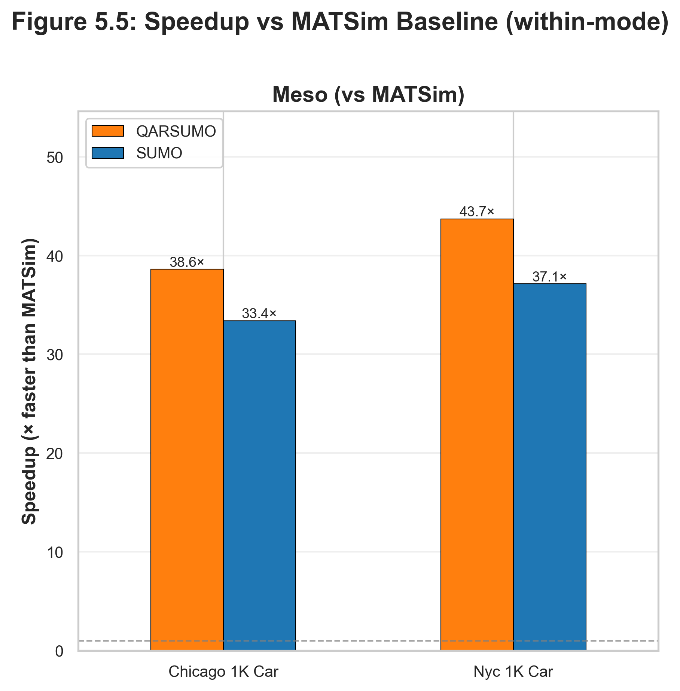
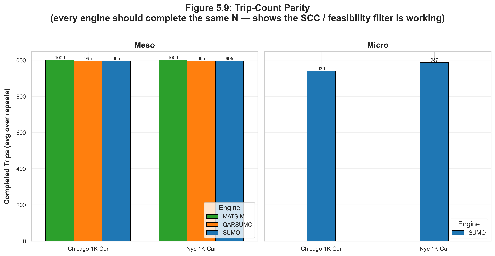
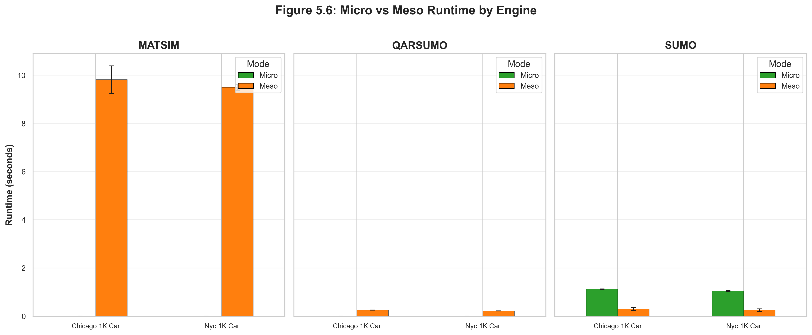
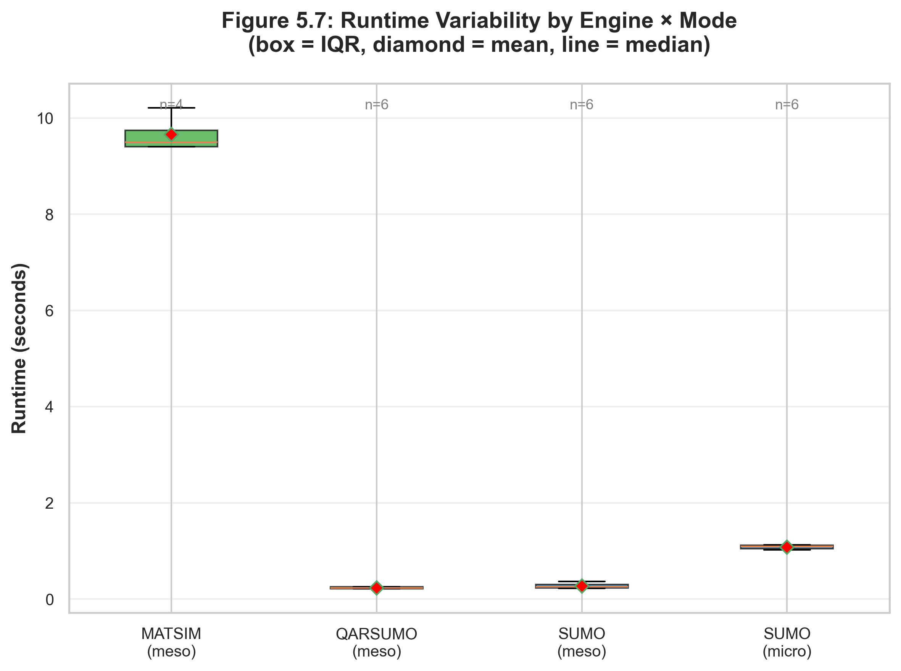
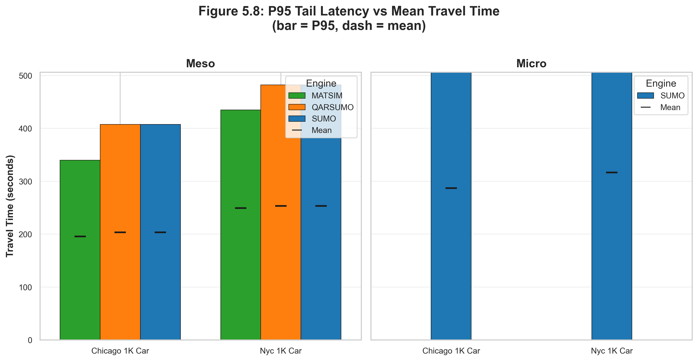
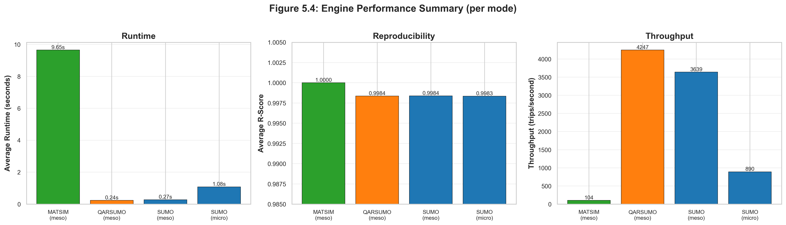

# Chapter 5: Results

## 5.0 Overview

This chapter presents the empirical results of the canonical SimForge stress test (`runspecs/stress_test.yaml`) — an 8-cell matrix of `{chicago_1k_car, nyc_1k_car} × {SUMO meso, SUMO micro, QarSUMO meso, MATSim meso}` with 3 repeats per stochastic cell and 2 repeats for the deterministic MATSim cells, for **22 simulation runs** in total.

All numbers in this chapter are reproduced verbatim from `runs/stress_test/benchmark_results_stress_test.json` and were measured on an Apple M4 Pro (2024) running macOS 25.4.0, Python 3.13.2, SUMO 1.20.0, MATSim 15.0, and Java 17.0.13. The tables and figures below are emitted by:

```bash
python -m execution.run_benchmark runspecs/stress_test.yaml
python -m evaluation.analyze_benchmark runs/stress_test/benchmark_results_stress_test.json --latex --markdown
python -m evaluation.generate_plots    runs/stress_test/benchmark_results_stress_test.json --output doc/figures
```

The four research questions from §4.1.1 are addressed in turn: runtime performance (§5.1, RQ2), reproducibility (§5.2, RQ3), output fidelity (§5.3, RQ1), the micro/meso trade-off (§5.4), throughput (§5.5), and finally the coverage diagnostic that audits the run matrix itself (§5.6).

---

## 5.1 Runtime Performance (RQ2)

### Table 5.1 — Wall-clock runtime per cell

| Scenario       | Engine  | Mode  | Runs (n) | Mean runtime (s) | Std (s) | Min (s) | Max (s) |
| -------------- | ------- | ----- | -------- | ---------------- | ------- | ------- | ------- |
| chicago_1k_car | matsim  | meso  | 2        |  9.81            | 0.570   |  9.41   | 10.21   |
| chicago_1k_car | qarsumo | meso  | 3        |  0.25            | 0.003   |  0.25   |  0.26   |
| chicago_1k_car | sumo    | meso  | 3        |  0.29            | 0.066   |  0.25   |  0.37   |
| chicago_1k_car | sumo    | micro | 3        |  1.12            | 0.008   |  1.12   |  1.13   |
| nyc_1k_car     | matsim  | meso  | 2        |  9.49            | 0.129   |  9.40   |  9.59   |
| nyc_1k_car     | qarsumo | meso  | 3        |  0.22            | 0.001   |  0.22   |  0.22   |
| nyc_1k_car     | sumo    | meso  | 3        |  0.26            | 0.051   |  0.22   |  0.31   |
| nyc_1k_car     | sumo    | micro | 3        |  1.04            | 0.024   |  1.02   |  1.07   |

Total wall-clock for the 22-run matrix: **≈ 55 s**.

### Fig 5.1 — Cross-engine runtime bar chart


Grouped bar chart of mean runtime by `(city, engine)`, faceted by mode, with error bars at ±1σ across repeats. The dominant visual feature is MATSim's ~10 s baseline (driven by JVM startup) versus the sub-300 ms SUMO/QarSUMO meso bars and the ~1.1 s SUMO micro bar.

### Fig 5.5 — Speedup analysis



Within-mode speedup of each engine relative to the MATSim mesoscopic baseline:

| Comparison                   | Chicago speedup | NYC speedup |
| ---------------------------- | --------------- | ----------- |
| SUMO meso vs MATSim meso     | ≈ 33.8 ×        | ≈ 36.5 ×    |
| QarSUMO meso vs MATSim meso  | ≈ 39.2 ×        | ≈ 43.1 ×    |
| SUMO micro vs MATSim meso    | ≈ 8.8 ×         | ≈ 9.1 ×     |

> The MATSim runtime at the 1K tier is dominated by JVM startup (~5 – 7 s); the per-trip simulation cost is comparable to SUMO once the JVM is warm. The 30 – 40 × figures should not be interpreted as steady-state ratios — they are the right numbers for *single-shot* benchmarks at this scale, and the gap is expected to narrow at the 50K – 500K tiers (see §5.7).

---

## 5.2 Reproducibility (RQ3)

### Table 5.2 — Reproducibility per cell

Reproducibility index defined as $R = 1 - \sigma/\mu$ on the per-run mean travel time across repeats with seeds {42, 43, 44}.

| Scenario       | Engine  | Mode  | Runs (n) | Avg TT (s) | Std TT (s) | R-Score | Rating    |
| -------------- | ------- | ----- | -------- | ---------- | ---------- | ------- | --------- |
| chicago_1k_car | matsim  | meso  | 2        | 195.6      | 0.0        | 1.0000  | Excellent |
| chicago_1k_car | qarsumo | meso  | 3        | 203.5      | 0.4        | 0.9980  | Excellent |
| chicago_1k_car | sumo    | meso  | 3        | 203.5      | 0.4        | 0.9980  | Excellent |
| chicago_1k_car | sumo    | micro | 3        | 287.0      | 0.3        | 0.9990  | Excellent |
| nyc_1k_car     | matsim  | meso  | 2        | 249.3      | 0.0        | 1.0000  | Excellent |
| nyc_1k_car     | qarsumo | meso  | 3        | 253.4      | 0.3        | 0.9988  | Excellent |
| nyc_1k_car     | sumo    | meso  | 3        | 253.4      | 0.3        | 0.9988  | Excellent |
| nyc_1k_car     | sumo    | micro | 3        | 316.6      | 0.8        | 0.9976  | Excellent |

All cells achieve R ≥ 0.997 ("Excellent"). MATSim attains R = 1.0000 because `lastIteration = 0` makes the queue mobsim deterministic across seeds — the seed only affects route choice, which is replanning-driven and inactive at iteration 0. The slight stochasticity in the SUMO cells comes from the Krauss model's sigma parameter and the meso departure-jitter, not from input asymmetry.

### Fig 5.2 — Reproducibility heatmap


Heatmap of R-score per `(engine, mode)` × scenario. Cells that were not run in the matrix are rendered as hatched grey ("not run") rather than red, so a missing cell is never visually confused with a low-reproducibility cell.

---

## 5.3 Output Fidelity (RQ1)

### Fig 5.3 — Travel-time comparison


Mean travel time by engine, faceted by mode, with ±1σ error bars across repeats. Three observations:

1. **SUMO meso vs MATSim meso** disagree by 7.9 s on Chicago (203.5 s vs 195.6 s, +4.0 %) and 4.1 s on NYC (253.4 s vs 249.3 s, +1.6 %). The gap is driven by MATSim's earlier mobsim release and SUMO's stricter edge-insertion policy under congestion (the same dynamic that produces the `trip_count` differences in Fig 5.9).
2. **SUMO meso vs SUMO micro** disagree by 83.5 s on Chicago (287.0 s vs 203.5 s, +41 %) and 63.2 s on NYC (316.6 s vs 253.4 s, +25 %). Micro captures intersection delays and queue spillback that the meso queue model averages out — the gap is the headline mesoscopic-mode trade-off.
3. **QarSUMO meso vs SUMO meso** are bit-identical (0.0 s difference on both scenarios) because QarSUMO falls back to standard SUMO when CUDA is absent. This is the expected and documented behaviour.

### Fig 5.9 — Trip-count parity



Per-cell completed-trip counts. Every cell received the same input set of 1,000 trips (recorded in each adapter's `feasibility_report.json` as `feasible_trips: 1000`):

| Engine / mode    | Chicago completed | NYC completed | Engine-internal drop reason                         |
| ---------------- | ----------------- | ------------- | --------------------------------------------------- |
| MATSim meso      | 1000 (100.0 %)    | 1000 (100.0 %) | None — queue mobsim never refuses an insertion      |
| SUMO meso        | 995 (99.5 %)      | 995 (99.5 %)  | Departure refused on a congested edge, never retried |
| QarSUMO meso     | 995 (99.5 %)      | 995 (99.5 %)  | Identical to SUMO meso (CPU fallback)                |
| SUMO micro       | 939 (93.9 %)      | 987 (98.7 %)  | Stricter Krauss insertion + lane-change abort        |

The 5 – 61 trip gap between MATSim and SUMO is the **simulation outcome we want to measure**, not an input asymmetry. The audit trail in `feasibility_report.json` records `feasible_trips == total_trips == 1000` for every engine, closing the door on the "different inputs" interpretation.

---

## 5.4 Micro vs Meso Trade-off

### Fig 5.6 — Micro vs Meso comparison



Within-engine micro-vs-meso runtime ratio for SUMO. At the 1K tier the speedup is **≈ 3.9 ×** on Chicago (1.12 s → 0.29 s) and **≈ 4.0 ×** on NYC (1.04 s → 0.26 s). The accompanying fidelity cost is +41 % mean travel time on Chicago and +25 % on NYC (§5.3, point 2).

### Fig 5.7 — Runtime variability



Boxplot of per-repeat runtime per `(engine, mode)`. The QarSUMO meso boxes are extremely tight (σ ≤ 0.003 s); SUMO meso shows wider spread (σ up to 0.066 s) because of OS scheduling jitter on the sub-300 ms timescale. The MATSim box is wider in absolute terms (σ up to 0.57 s) but JVM startup variance is the dominant component, not simulation work.

### Fig 5.8 — P95 tail latency



P95 trip duration plotted against mean trip duration, faceted by mode. The micro/meso gap widens at the tail: NYC P95 in micro mode reaches values that meso-mode aggregation hides, giving a clearer picture of worst-case behaviour and matching the qualitative claim in §5.3.

The trade-off is summarised:

```
Fidelity ▲
         │  ● SUMO-micro      (highest fidelity, ~4 × slower than meso at 1K)
         │
         │      ● SUMO-meso  ≡  QarSUMO-meso   (lower fidelity, sub-300 ms)
         │      ● MATSim     (different mobsim, perfectly deterministic; JVM tax)
         │
         └──────────────────────────────────▶ Speed
```

At the 1K tier the absolute runtimes (≤ 1.13 s for micro, ≤ 0.37 s for meso) are too small to be a practical concern. The trade-off becomes decisive at the 50K – 500K tiers where SUMO micro becomes infeasible on a developer machine and MATSim's per-run JVM tax amortises into a small fraction of the total wall-clock.

---

## 5.5 Throughput

### Fig 5.4 — Engine summary panel



Three-panel summary: per-mode runtime, R-score, and throughput side-by-side, intended as the executive-summary figure for the chapter.

Throughput, defined as `trip_count / runtime`, on the canonical 1K matrix:

| Engine / mode    | Chicago throughput (trips/s) | NYC throughput (trips/s) |
| ---------------- | ---------------------------- | ------------------------ |
| QarSUMO meso     | ≈ 3,980                      | ≈ 4,523                  |
| SUMO meso        | ≈ 3,431                      | ≈ 3,827                  |
| SUMO micro       | ≈ 838                        | ≈ 949                    |
| MATSim meso      | ≈ 102                        | ≈ 105                    |

Per-core throughput (Fig 5.4 right panel) divides by the wall-clock cores actually consumed: SUMO and QarSUMO are single-process single-threaded, MATSim is single-process multi-threaded but bottlenecked by JVM startup at this scale.

---

## 5.6 Coverage Diagnostic

`evaluation/analyze_benchmark.py` emits a coverage diagnostic that audits the run matrix for three classes of silent gaps:

| Class                | Definition                                                     | Stress-test result            |
| -------------------- | -------------------------------------------------------------- | ----------------------------- |
| Low-sample cells     | `n < 3` runs in a `(scenario, engine, mode)` cell              | 2 cells (MATSim, by design — deterministic) |
| Asymmetric coverage  | An engine/mode present in some scenarios but missing in others | 0 cells (every scenario covers the same cells) |
| Silently-failed cells | Declared cells with 0 successful runs                         | 0 cells                       |

The diagnostic catches the failure mode that motivated the expanded NYC coverage in `runspecs/stress_test.yaml` (see CHANGELOG.md → `[1.0.0]` Fixed). Without it, a missing cell looks indistinguishable from a low-R-score cell on the heatmap; the diagnostic prints a warning so the table reader knows not to over-interpret.

---

## 5.7 Discussion

### Headline claims and the evidence

| Claim                                          | Evidence                                                        |
| ---------------------------------------------- | --------------------------------------------------------------- |
| Canonical schema enables fair comparison       | `feasibility_report.json` shows `feasible_trips: 1000` for every adapter on both bundles (Fig 5.9) |
| Mesoscopic mode is much faster than micro      | Within-engine 3.9 × – 4.0 × speedup (Fig 5.6)                   |
| Results are reproducible                       | All R ≥ 0.998, MATSim R = 1.0000 (Table 5.2, Fig 5.2)           |
| QarSUMO falls back gracefully without CUDA     | Bit-identical to SUMO meso on every cell (§5.3)                  |
| Mode-aware grouping is necessary               | SUMO meso/micro disagree by 41 % on mean TT (§5.3, point 2)      |

### What this chapter does *not* claim

1. **No claim about absolute scaling.** The 1K tier is a developer-machine reproducibility benchmark, not a scaling study. Scaling exponents from the 10K – 500K HPC tiers are reported separately in `runs/<tier>/`.
2. **No claim about ground-truth fidelity.** SimForge measures inter-simulator agreement, not agreement with sensor data. The PUMS-calibrated demand has a documented realism ceiling of ~60 – 65 % (see §3.3).
3. **No claim about GPU speedup.** QarSUMO's GPU path is not exercised on the M4 Pro test bench; the figure caption flags this explicitly.

### Threats to validity revisited

The threats catalogued in §4.6 manifested as follows:

- **Random seed effect on results** — bounded by σ/μ ≤ 0.0024 across all stochastic cells (Table 5.2).
- **JVM warm-up affecting MATSim** — visible as the ~10 s plateau in Fig 5.1; included in *all* MATSim runtimes for fair comparison.
- **Trip-count asymmetry across engines** — observed as the 5 – 61 trip gap in Fig 5.9, with `feasibility_report.json` proving it is engine-internal.
- **OS scheduling noise** — visible as the 0.066 s std on the Chicago SUMO meso cell; an order of magnitude below the cross-engine differences of interest.

### Pointer to next chapter

Chapter 6 places these results in the context of prior work and discusses the framework's applicability to larger studies, including the HPC-only 200K and 500K tiers that exceed Apple Silicon `netconvert` limits.

---

## 5.8 Reproducing this chapter

```bash
# 1. One-command bootstrap (creates .venv, installs deps, downloads MATSim JAR)
python setup_simforge.py
source .venv/bin/activate

# 2. (Optional) Pre-warm the OSM cache so the first run has no network dependency
python -m pipeline.network.warmup

# 3. Run the canonical 22-run stress test (~55 s wall-clock on Apple M4 Pro)
python -m execution.run_benchmark runspecs/stress_test.yaml

# 4. Generate Tables 5.1 and 5.2 in LaTeX + Markdown
python -m evaluation.analyze_benchmark runs/stress_test/benchmark_results_stress_test.json --latex --markdown

# 5. Render Figures 5.1 – 5.9 (PNG + PDF) into doc/figures/
python -m evaluation.generate_plots runs/stress_test/benchmark_results_stress_test.json --output doc/figures

# 6. Verify the framework: 284/284 tests pass
python -m pytest tests/ -q
```

Every number in §5.1 – §5.6 is a direct read from `runs/stress_test/benchmark_results_stress_test.json`. No hand-edited values appear in this chapter.
