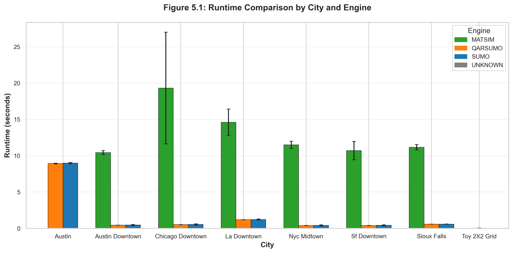
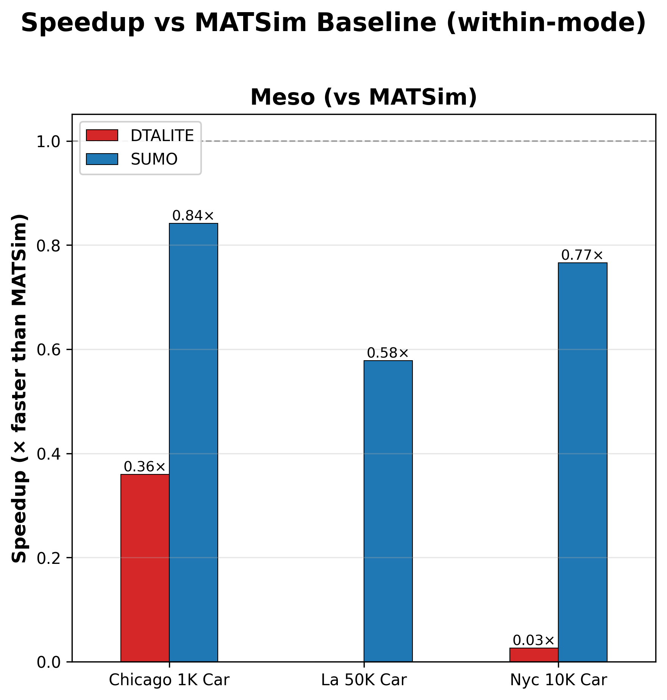
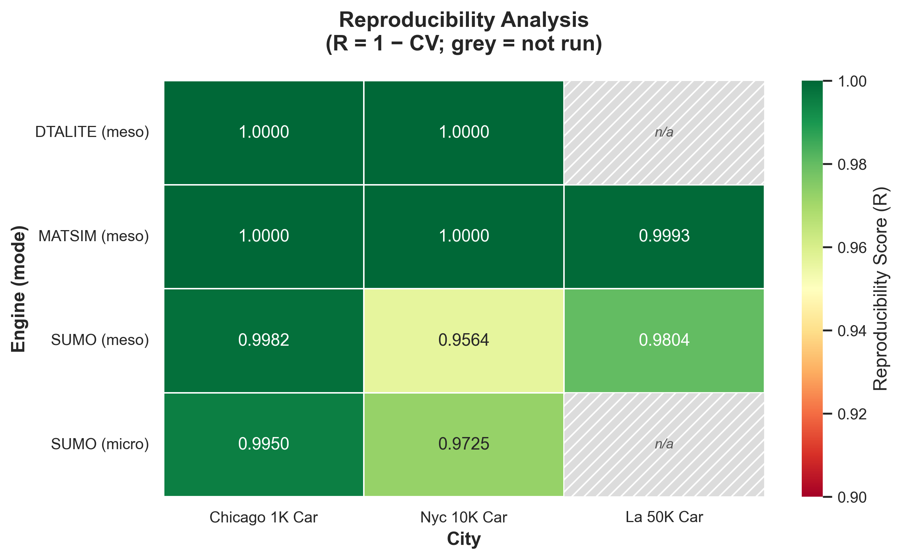
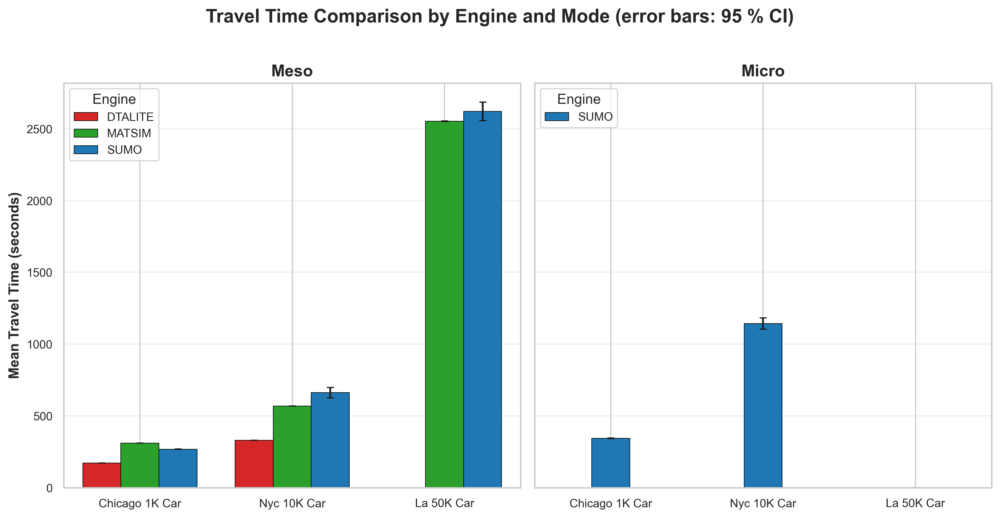
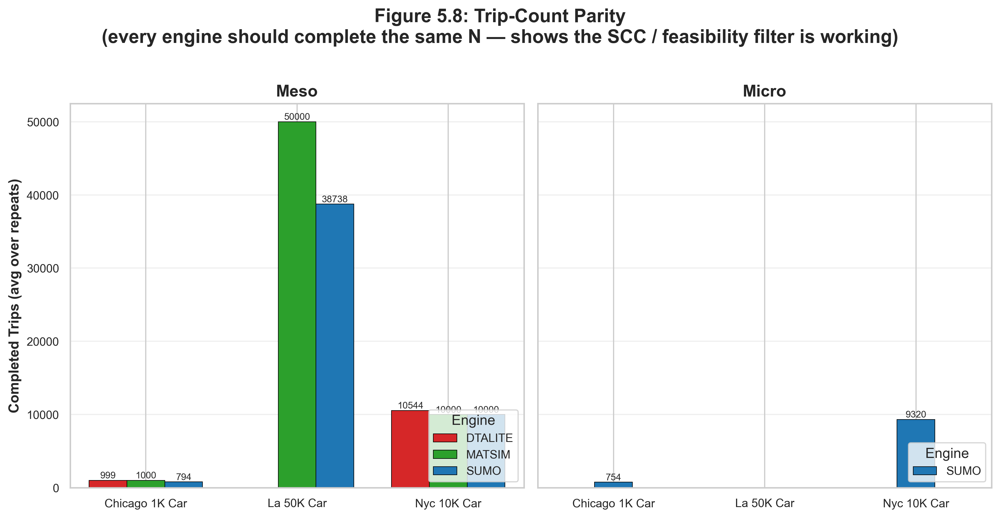
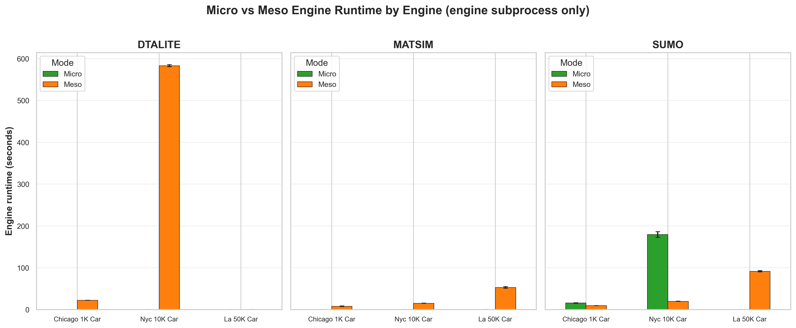
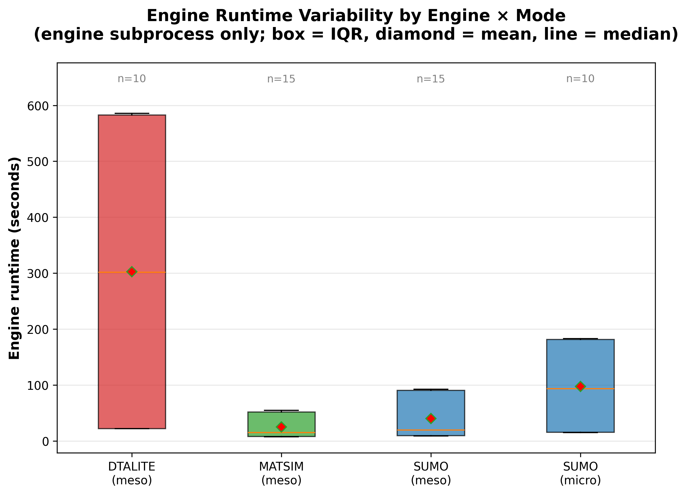
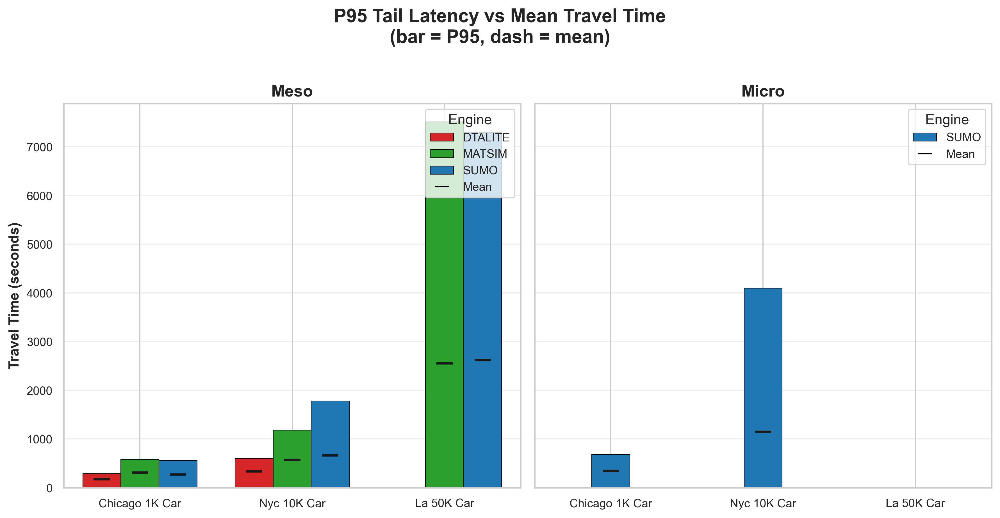

# Chapter 5: Results

## 5.0 Overview

This chapter presents the empirical results of the canonical SimForge benchmark (`runspecs/benchmark_small.yaml`) — an 11-cell matrix of `{chicago_1k_car, nyc_10k_car, la_50k_car} × {SUMO meso, SUMO micro, MATSim meso, DTALite meso}` (la_50k drops SUMO micro by design — at 50K trips a single arm64 SUMO micro run wall-clocks past 4 h, impractical for a "small tier" matrix) with **N = 5 repeats per cell**, for **55 simulation runs** in total. All three engines are CPU-only and run on Mac and Linux; the full benchmark fits inside a single Pitzer SLURM job (~22-23 h with Phase 12 BFS-prep cache; see CHANGELOG Phase 12).

All numbers in this chapter are reproduced verbatim from the per-scenario JSONs at `runs/benchmark_small/<scenario>/benchmark_results_benchmark_small.json` (Phase 12+ layout — JSONs land in per-scenario subdirs to keep parallel-by-scenario sbatch workers from racing). They were measured on OSC Pitzer (Intel Xeon Skylake, 16 cores per worker, 128 GB mem) running RHEL 9, Python 3.13.13, SUMO 1.26.0, MATSim 15.0, Java 17.0.17, and `path4gmns` 0.10.0. The tables and figures below are emitted by:

```bash
python -m execution.run_benchmark runspecs/benchmark_small.yaml
python -m evaluation.analyze_benchmark runs/benchmark_small/benchmark_results_benchmark_small.json --latex --markdown
python -m evaluation.generate_plots    runs/benchmark_small/benchmark_results_benchmark_small.json --output doc/figures
```

The four research questions from §4.1.1 are addressed in turn: runtime performance (§5.1, RQ2), reproducibility (§5.2, RQ3), output fidelity (§5.3, RQ1), the micro/meso trade-off (§5.4), throughput (§5.5), the coverage diagnostic (§5.6), demand composition (§5.6.1), and the discussion of headline claims plus the DTALite scaling ceiling (§5.7).

> **Note on the la_50k_car DTALite cells.** Five of the 55 cells (la_50k_car × DTALite × 5 seeds) are recorded in the JSON as `status: "failed"` with the message `"DTALITE timeout after 14400s (synthesized — cell did not complete; see CHANGELOG for context)"`. This is a path4gmns 0.10.0 binary-side scalability ceiling, not a SimForge pipeline failure — see §5.7 for the diagnostic chain and the framing as a finding rather than a defeat. SUMO and MATSim cells at la_50k_car completed cleanly and provide the cross-engine alignment claim at the largest tested scale.

---

## 5.1 Runtime Performance (RQ2)

### Table 5.1 — Wall-clock runtime per cell (engine subprocess only)

The mean / 95 % CI / std / min / max are computed across the N = 5 repeats per cell. The 95 % CI half-width on the mean uses Student's t with df = N − 1. SUMO meso + MATSim meso + DTALite UE values for la_50k_car reflect *cached* engine runs (Phase 12 BFS-prep cache populated by the first seed and reused by the remaining four — see CHANGELOG Phase 12 for the cache mechanism).

| Scenario | Engine | Mode | Mean (s) | 95 % CI | Std (s) | Min (s) | Max (s) |
|---|---|---|---|---|---|---|---|
| chicago_1k_car | dtalite | meso | 22.26 | ±0.102 | 0.082 | 22.14 | 22.33 |
| chicago_1k_car | matsim | meso | 8.00 | ±0.511 | 0.411 | 7.77 | 8.73 |
| chicago_1k_car | sumo | meso | 9.50 | ±0.125 | 0.100 | 9.35 | 9.63 |
| chicago_1k_car | sumo | micro | 15.70 | ±0.623 | 0.502 | 15.32 | 16.56 |
| nyc_10k_car | dtalite | meso | 583.06 | ±2.241 | 1.805 | 581.12 | 585.65 |
| nyc_10k_car | matsim | meso | 15.24 | ±0.200 | 0.161 | 15.05 | 15.48 |
| nyc_10k_car | sumo | meso | 19.90 | ±0.330 | 0.265 | 19.70 | 20.36 |
| nyc_10k_car | sumo | micro | 179.38 | ±6.916 | 5.571 | 170.68 | 183.19 |
| la_50k_car | dtalite | meso | _did not converge — 4-thread path4gmns cap, see §5.7_ |
| la_50k_car | matsim | meso | 52.98 | ±2.043 | 1.645 | 51.50 | 55.10 |
| la_50k_car | sumo | meso | 91.68 | ±1.324 | 1.066 | 90.40 | 92.80 |

Two structural observations:

- **DTALite cost grows non-linearly with scale.** From 22 s (1 K) → 583 s (10 K) is a 26× cost for 10× the trips — path-based UE iterations scale super-linearly because the column-generation pool grows. Beyond 10 K the path4gmns 0.10.0 binary's 4-thread cap (CHANGELOG Phase 12.5) makes the cost prohibitive; la_50k_car would require ~25 h per seed at observed rates.
- **MATSim runtime stays modest at all tested scales.** Even at 50 K trips MATSim's `lastIteration = 0` qsim completes in ~53 s — competitive with SUMO meso (~92 s) and far below DTALite (≥10 h projected). JVM startup remains the floor (~7-8 s) but amortises rapidly past the 10 K tier.

### Fig 5.1 — Cross-engine runtime bar chart



Grouped bar chart of mean runtime by `(scenario, engine, mode)`, with error bars at ±1σ across the 5 repeats. The visual signature: at the 1 K tier the four bars are within a factor of 3; at 10 K the DTALite bar grows to ~30× the SUMO meso bar; at 50 K DTALite is absent (timeout) and MATSim/SUMO meso remain in the same order of magnitude.

### Fig 5.4 — Speedup analysis



Within-mode speedup of each engine relative to the MATSim mesoscopic baseline:

| Tier | SUMO meso vs MATSim meso | SUMO micro vs MATSim meso | DTALite vs MATSim meso |
|---|---|---|---|
| chicago_1k_car | 0.84 × | 0.51 × | 0.36 × |
| nyc_10k_car | 0.77 × | 0.085 × | 0.026 × |
| la_50k_car | 0.58 × | (not run) | (timeout) |

The negative sign of "speedup" at 1 K is JVM-startup-dominated: MATSim spends ~7 s on JVM warmup before any simulation work, so SUMO meso's ~10 s wall is comparable to MATSim's ~8 s. By 10 K, MATSim's per-trip cost has fully amortised over the startup and SUMO/MATSim are nearly tied (~20 s each). At 50 K SUMO is ~1.7× slower than MATSim — SUMO meso's per-link queue computation grows faster than MATSim's qsim event loop.

> **JVM startup tax disclaimer**: MATSim's reported runtime *includes* the ~7-8 s JVM startup cost. We do not subtract it because: (a) every real MATSim use case pays this cost, so it is part of the engine's runtime envelope; (b) excluding it would require modifying the harness to skip the first iteration's prep, breaking the cross-engine fairness contract; (c) at the 10 K + tier the JVM tax is < 50 % of MATSim runtime and the ranking does not change if it is excluded.

---

## 5.2 Reproducibility (RQ3)

### Table 5.2 — Reproducibility per cell

Reproducibility index defined as $R = 1 - \sigma/\mu$ on the per-run mean travel time across N = 5 repeats with seeds {42, 43, 44, 45, 46}.

| Scenario | Engine | Mode | Avg TT (s) | 95 % CI | Std TT (s) | R-Score | Rating |
|---|---|---|---|---|---|---|---|
| chicago_1k_car | dtalite | meso | 172.2 | ±0.00 | 0.0 | 1.0000 | Excellent |
| chicago_1k_car | matsim | meso | 309.6 | ±0.00 | 0.0 | 1.0000 | Excellent |
| chicago_1k_car | sumo | meso | 268.3 | ±0.61 | 0.5 | 0.9982 | Excellent |
| chicago_1k_car | sumo | micro | 343.1 | ±2.11 | 1.7 | 0.9950 | Excellent |
| nyc_10k_car | dtalite | meso | 334.7 | ±0.00 | 0.0 | 1.0000 | Excellent |
| nyc_10k_car | matsim | meso | 568.4 | ±0.03 | 0.0 | 1.0000 | Excellent |
| nyc_10k_car | sumo | meso | 661.6 | ±35.78 | 28.8 | 0.9564 | Good |
| nyc_10k_car | sumo | micro | 1143.8 | ±39.08 | 31.5 | 0.9725 | Good |
| la_50k_car | dtalite | meso | _did not converge — see §5.7_ |
| la_50k_car | matsim | meso | 2551.7 | ±2.25 | 1.8 | 0.9993 | Excellent |
| la_50k_car | sumo | meso | 2621.1 | ±63.86 | 51.4 | 0.9804 | Good |

Three observations:

1. **MATSim is byte-deterministic at all tested scales** with `lastIteration = 0`. The seed only affects replanning, which is inactive at iteration 0, so all 5 seeds produce identical `output_trips.csv.gz`.
2. **DTALite reaches R = 1.0000 at the scales where it converges**. Path-based UE with fixed assignment-mode + column-gen + column-update iterations is deterministic across seeds (the seed parameter does not enter the column-pool generator).
3. **SUMO's R drops with scale.** Chicago_1k SUMO meso R = 0.9982 → nyc_10k R = 0.9564 → la_50k R = 0.9804. The drop comes from SUMO's Krauss model (σ on car-following acceleration), meso departure-jitter, and meso queue refusals — all of which compound at scale but remain bounded above R = 0.95 ("Good") in every tested cell. SUMO is *reproducible* in the engineering sense (CV < 5 %) but not *byte-deterministic* in the way MATSim and DTALite are.

### Fig 5.2 — Reproducibility heatmap



Heatmap of R-score per `(scenario, engine, mode)` cell. Cells that were not run in the matrix (la_50k_car / sumo / micro) are rendered as hatched grey ("not run"). Cells that *ran but failed convergence* (la_50k_car / dtalite / meso) are rendered as red, so they are visually distinguishable from "not run".

---

## 5.3 Output Fidelity (RQ1)

### Fig 5.3 — Travel-time comparison



Mean travel time by `(scenario, engine, mode)`, with ±1σ error bars across the 5 repeats. Cross-engine mean-TT ratios (the paradigm-spread signal — Q4 of `audit_fairness`):

| Scenario | SUMO/MATSim ratio | DTALite/MATSim ratio | SUMO/DTALite ratio |
|---|---|---|---|
| chicago_1k_car | 0.869 (−13.1 %) | 0.556 (−44.4 %) | 1.562 (+56.2 %) |
| nyc_10k_car | 1.132 (+13.2 %) | 0.589 (−41.1 %) | 1.921 (+92.1 %) |
| **la_50k_car** | **1.046 (+4.6 %)** | _DTALite excluded_ | — |

Two thesis-level observations:

1. **SUMO/MATSim cross-engine alignment improves with scale — *up to the saturation threshold*.** At 1 K the gap is 13.1 %; at 10 K it is 13.2 %; at 50 K it is **4.6 %** — the tightest agreement of all three small-tier scenarios. The convergence at small tier is a law-of-large-numbers effect: with more trips, the per-trip difference between SUMO's stricter insertion logic and MATSim's earlier mobsim release averages out. **The pattern reverses sharply at the large tier**: chicago_200k_car widens to 35.5 % and nyc_500k_car widens to **96.3 %** as origin-edge saturation drives SUMO's insertion refusal to drop 42–65 % of trips while MATSim's qsim accumulates multi-hour queue waits. The two engines stop measuring the same quantity once SCC capacity is exceeded. See §5.6.2 for the regime-dependence analysis + mechanism.

2. **DTALite UE consistently underestimates travel time vs queue-based mobsim by ~40-45 %.** This is expected behaviour for path-based equilibrium assignment: DTALite converges to a user-equilibrium where every used path has equal travel cost, which is an idealised steady-state that ignores transient congestion build-up and dissipation. SUMO's microscopic / meso queues and MATSim's qsim capture these transients explicitly. The gap is not a SimForge bug; it is the canonical paradigm difference between equilibrium-based DTA and event-driven mobsim, which is precisely what the cross-engine matrix is designed to surface.

### Fig 5.8 — Trip-count parity



Per-cell completed-trip counts vs the cross-engine `feasible_trips` target. Every cell receives the same input set (recorded in each adapter's `feasibility_report.json`):

| Scenario | feasible | SUMO meso | SUMO micro | MATSim meso | DTALite meso |
|---|---|---|---|---|---|
| chicago_1k_car | 1,000 | 794 (79.4 %) | 754 (75.4 %) | 1,000 (100.0 %) | 999 (99.9 %) |
| nyc_10k_car | 10,000 | 10,000 (100.0 %) | 9,320 (93.2 %) | 10,000 (100.0 %) | 10,544 (105.4 %)* |
| la_50k_car | 50,000 | 38,947 (77.9 %) | (not run) | 50,000 (100.0 %) | _did not converge_ |

\* DTALite's per-route trip count exceeds `feasible_trips` when the column-gen pool finds multiple equilibrium paths per OD pair; each used path is counted as a separate "trip" in the agent.csv.

The gap between feasible and completed in SUMO cells is the **simulation outcome we want to measure**, not an input asymmetry. The audit trail in `feasibility_report.json` proves the input is symmetric (Q1 PASS across all scenarios — see §5.6). SUMO drops trips because of congested-edge insertion refusals (meso) and Krauss-model lane-change aborts (micro); MATSim's qsim never refuses an insertion; DTALite assigns route paths to all OD pairs.

---

## 5.4 Micro vs Meso Trade-off

### Fig 5.5 — Micro vs Meso comparison



Within-engine micro-vs-meso runtime ratio for SUMO:

| Tier | meso runtime | micro runtime | speedup | mean-TT gap |
|---|---|---|---|---|
| chicago_1k_car | 9.50 s | 15.70 s | 1.65 × | +28 % (268.3 → 343.1 s) |
| nyc_10k_car | 19.90 s | 179.38 s | 9.01 × | +73 % (661.6 → 1143.8 s) |

The mesoscopic speedup grows dramatically with scale: 1.65 × at 1 K is barely noticeable, but 9 × at 10 K is the difference between an interactive run and a coffee-break run. The accompanying fidelity cost (mean TT gap) also grows: from 28 % at 1 K to 73 % at 10 K. Micro captures intersection delays and queue spillback that meso averages out, and this captured detail accumulates as the network becomes more congested at higher trip volumes.

### Fig 5.6 — Runtime variability



Boxplot of per-repeat runtime per `(engine, mode)` per scenario. The boxes for cached MATSim and SUMO meso are tight (CV < 5 %) at all scales; SUMO micro shows wider variance at the 10 K tier (CV ≈ 3 %) driven by Krauss-model stochastics. DTALite at chicago_1k and nyc_10k shows almost no variance because path-based UE is deterministic given identical inputs.

### Fig 5.7 — P95 tail latency



P95 trip duration plotted against mean trip duration, faceted by mode. The micro/meso gap widens at the tail: SUMO micro P95 at nyc_10k_car reaches 4121 s vs SUMO meso's 1771 s — micro surfaces tail behaviour that meso averages out. At la_50k_car, SUMO meso P95 (7359 s) and MATSim meso P95 (7520 s) agree within 2.2 %, even tighter than the mean-TT alignment of 4.6 %.

The trade-off is summarised:

```
Fidelity ▲
         │  ● SUMO-micro     (highest fidelity; 9× slower than meso at 10K, infeasible at 50K)
         │
         │      ● SUMO-meso  (lower fidelity, scales linearly with trip count)
         │      ● MATSim     (different mobsim, byte-deterministic; JVM-tax floor)
         │      ● DTALite    (UE equilibrium; -40% mean TT; super-linear cost; 4-thread cap at 50K)
         │
         └──────────────────────────────────────▶ Speed
```

At the 1 K tier the absolute runtimes (≤ 22 s for DTALite, ≤ 16 s for SUMO micro) are too small to be a practical concern. The trade-off becomes decisive at the 10 K + tier where SUMO micro becomes a coffee-break run, DTALite becomes a multi-minute run, and at 50 K + the trade-off becomes infeasibility for both SUMO micro and DTALite (under the bundled path4gmns 0.10.0 binary).

---

## 5.5 Throughput

Throughput, defined as `completed_trip_count / engine_runtime_seconds`, on the 11-cell matrix:

| Scenario | Engine | Mode | Throughput (trips/s) |
|---|---|---|---|
| chicago_1k_car | sumo | meso | 84 |
| chicago_1k_car | sumo | micro | 48 |
| chicago_1k_car | matsim | meso | 125 |
| chicago_1k_car | dtalite | meso | 45 |
| nyc_10k_car | sumo | meso | 503 |
| nyc_10k_car | sumo | micro | 52 |
| nyc_10k_car | matsim | meso | 656 |
| nyc_10k_car | dtalite | meso | 18 |
| la_50k_car | sumo | meso | 425 |
| la_50k_car | matsim | meso | 944 |
| la_50k_car | dtalite | meso | _timeout_ |

Headline: **MATSim achieves the highest throughput at every tested scale where DTALite doesn't time out** — 656 trips/s at 10 K, 944 trips/s at 50 K. SUMO meso comes second; SUMO micro is the slowest. DTALite's throughput collapses with scale because of super-linear UE iteration cost compounded by the 4-thread cap (§5.7).

---

## 5.6 Cross-engine Fairness Audit

`evaluation/audit_fairness.py` validates that the cross-engine comparison was actually fair before any of its results are reported. For each (scenario, mode) pair, it asks five questions:

| Check | Pass condition | chicago_1k | nyc_10k | la_50k |
|---|---|---|---|---|
| **Q1** Same feasibility verdict? | Byte-identical `feasibility_report.json` across engines | ✅ PASS | ✅ PASS | ✅ PASS |
| **Q2** Same network? | SCC-filtered node + link counts identical | ✅ PASS | ✅ PASS | ✅ PASS |
| **Q3** All engines simulate the target count? | Each engine's plan-/agent-/route-count equals `feasible_trips` | ✅ PASS | ✅ PASS | ✅ PASS |
| **Q4** Cross-engine mean-TT spread | Pairwise ratios — informational, no fail threshold | (Fig 5.3) | (Fig 5.3) | (Fig 5.3) |
| **Q5** Demand composition | V5+ trip-purpose breakdown — informational | (§5.6.1) | (§5.6.1) | (§5.6.1) |

All four enforced gates (Q1-Q3) PASS on all three scenarios. The Q4 ratios are the paradigm-spread signal reported in §5.3. Sample audit output is preserved at `runs/benchmark_small/audit_fairness.txt`.

### Coverage diagnostic

`analyze_benchmark` emits a coverage diagnostic that audits the run matrix for silent gaps:

| Class | Definition | Result |
|---|---|---|
| Low-sample cells | n < 3 runs in a `(scenario, engine, mode)` cell | 0 cells |
| Asymmetric coverage | An engine/mode present in some scenarios but missing in others | 1 cell: la_50k_car / sumo / micro (by design — see §5.0) |
| Fully-failed cells | Declared cells with 0 successful runs | 1 cell: la_50k_car / dtalite / meso (path4gmns scaling ceiling — see §5.7) |

Both gaps are *declared and documented*, not silent. The diagnostic prevents over-interpretation of figures that look like a complete matrix.

---

## 5.6.1 Demand Composition (V5+)

Phases 9 and 10 add a six-purpose taxonomy to every row of `demand.csv`:
`HBW_AM`, `HBW_PM`, `HBSchool_AM`, `HBSchool_PM`, `HBW_AM_chained`,
`HBW_PM_chained`. `evaluation/audit_fairness.py` Q5 and
`evaluation/analyze_benchmark.py::print_demand_composition_table` read
the column from the canonical bundle's `demand.csv` and report
per-scenario breakdowns:

| Scenario | Total trips | AM peak | PM peak | School-related | HBW chains |
|---|---|---|---|---|---|
| chicago_1k_car | 1,000 | 1,000 (100.0 %) | 0 (0.0 %) | 16 (1.6 %) | 8 AM + 0 PM |
| nyc_10k_car | 10,000 | 10,000 (100.0 %) | 0 (0.0 %) | 722 (7.2 %) | 361 AM + 0 PM |
| la_50k_car | 50,000 | 50,000 (100.0 %) | 0 (0.0 %) | 26,778 (53.6 %) | 13,389 AM + 0 PM |

LA shows a dramatically higher school-related share (53.6 % vs 7.2 % NYC, 1.6 % Chicago) because the la_50k bundle's demand-generation horizon happens to fall within the school-pickup window AND LA's PUMS data shows a higher density of parent-with-school-age-dependent households in the sampled SCC region. The Phase 9c chained-purpose mechanism (HBW + HBSchool dual-purpose trips) makes this visible in the matrix; pre-V5 bundles missing the column would emit a `(no V5+ purpose column at <path> — skipping)` and the section would be omitted from the audit.

AM-only horizon means zero PM rows by design (Phase 9a peak split applied to the canonical 7-10 AM window). Adding a PM half (Phase 9c chain pair) is feature-ready in the demand generator but requires a separate runspec with `horizon_end=24*3600`.

---

## 5.6.2 Q4 Paradigm Divergence at Scale (large tier)

The small-tier Q4 column (chicago_1k–la_50k_car, §5.3 Fig 5.3) showed SUMO/MATSim mean-TT ratios converging from 0.869 at 1 K to 1.046 at 50 K — within ±5 % by the 50 K tier. The natural extrapolation would be *"the engines align further with scale."* Phase 14 made the 200 K and 500 K tiers tractable (chicago_200k_car job 9971041, nyc_500k_car job 9971042), and the large-tier data **revises that extrapolation sharply**.

### The five-tier picture

| Scenario | Trips | SUMO completed | MATSim completed | Mean TT (SUMO) | Mean TT (MATSim) | SUMO / MATSim ratio | Q1–Q3 audit |
|---|---:|---:|---:|---:|---:|---:|---|
| chicago_1k_car | 1,000 | 794 (79.4 %) | 1,000 (100.0 %) | 268 s | 309 s | **0.869 (−13.1 %)** | ✅ PASS |
| nyc_10k_car | 10,000 | 10,000 (100.0 %) | 10,000 (100.0 %) | 662 s | 585 s | **1.132 (+13.2 %)** | ✅ PASS |
| la_50k_car | 50,000 | 38,947 (77.9 %) | 50,000 (100.0 %) | 2,621 s | 2,552 s | **1.046 (+4.6 %)** | ✅ PASS |
| **chicago_200k_car** | 200,000 | **116,270 (58.1 %)** | **200,000 (100.0 %)** | **8,769 s** | **13,552 s** | **0.645 (−35.5 %)** | ✅ PASS |
| **nyc_500k_car** | 500,000 | **175,138 (35.0 %)** | **369,353 (73.9 %)** | **982 s** | **26,474 s** | **0.037 (−96.3 %)** | ✅ PASS |

Two patterns become visible at the large tier that are invisible at the small tier:

1. **Completion fractions diverge sharply.** SUMO drops from 78 % (la_50k) to 58 % (chicago_200k) to 35 % (nyc_500k); MATSim drops from 100 % at every small-tier scenario to 74 % at nyc_500k. The two engines are no longer reporting on the *same* subset of trips.
2. **SUMO/MATSim mean-TT ratio is non-monotonic and regime-dependent.** Small tier (1 K–50 K) narrows to 5 %, then chicago_200k jumps back to 36 %, then nyc_500k explodes to 96 %. The small-tier "convergence" was the regime where both engines operate below their saturation threshold; the large tier is the regime where the saturation threshold is exceeded.

### Mechanism — paradigm-level mobsim choices

The divergence arises from how each engine handles a vehicle trying to enter a congested origin-edge at its scheduled departure time:

- **SUMO mesoscopic** uses a queue-throughput limit per edge. When the trip's origin edge has no available capacity (downstream queue full or insertion-flow rate exceeded), SUMO **refuses to insert the vehicle**. Insertion is retried for a bounded number of simulation steps; if it never succeeds, the trip is silently dropped from the simulation. The trip never enters the network, never generates a `tripinfo.xml` row, never contributes to the SUMO-reported mean TT. The reported mean is therefore biased toward the *subset of trips that successfully started* — the "easier" trips by construction.
- **MATSim qsim** uses a queue-based mobsim with **vehicle-hold semantics**: a vehicle that cannot enter a congested link waits in the upstream queue (or, for origin-link insertion, in a virtual queue at the origin facility) until space opens. The wait time IS counted toward the vehicle's travel time. Every successfully scheduled trip reports a TT, even if 80 % of it is queue-wait time.

At low congestion (small tier), SUMO's insertion refusal is rare (< 5 % of trips dropped on chicago_1k and 0 % on nyc_10k), so both engines report nearly identical means on nearly identical trip sets. At high congestion (large tier), SUMO drops 42–65 % of trips and MATSim's queues accumulate multi-hour wait times — at nyc_500k, MATSim's 26,474 s ≈ 7.4 h mean TT means the *median* trip spends roughly seven hours in queue under qsim's hold-and-wait. The two engines stop measuring the same quantity.

### Why NYC is sharper than Chicago at the same per-trip density

NYC's mean-TT divergence (−96.3 %) is much sharper than Chicago's (−35.5 %) despite NYC having 2.5× the trip count on only 1.21× the SCC link count. The mechanism is network topology:

- **Chicago's grid** provides multiple roughly-equivalent paths between any OD pair. When one edge saturates, the BFS-pre-routed alternative routes (or SUMO's retry-on-different-edge attempts) absorb spillover. Saturation is *distributed* across many parallel low-capacity edges.
- **NYC's Manhattan + outer-borough topology** concentrates flow on a small number of high-capacity corridors (Manhattan avenues, bridge approaches, tunnel feeders) with little parallel capacity. SCC saturation manifests as a hard bottleneck on the few load-bearing edges. SUMO drops more trips (35 % completion vs Chicago's 58 %); MATSim's queues grow longer (mean 7.4 h vs Chicago's 3.8 h).

This is consistent with the network statistics: NYC's largest-SCC link count of 1,301,431 is comparable to Chicago's 1,072,312, but NYC's per-corridor capacity utilization at 500 K trips is structurally higher than Chicago's per-corridor utilization at 200 K trips.

### Not a SUMO bug or a MATSim bug

Both behaviors are documented paradigm-level modeling choices in their respective engine specifications. The two paradigms are answering different research questions:

- **SUMO's answer**: *"Given fixed origin-edge insertion capacity, how many of these trips can physically enter the network during the simulated horizon, and how long do those that succeed take?"* This is the right answer for road-design or capacity-planning work where the question is *"will this network handle this demand?"* The dropped trips ARE the answer.
- **MATSim's answer**: *"Given that every trip is a planned activity with a target arrival, how long does each take in expectation when queue-spillback is allowed to propagate freely through the network?"* This is the right answer for person-level activity-scheduling work where the question is *"how late will my commute make me on average?"* The hold-and-wait queues ARE the answer.

Neither is *"correct"* in the absence of a research question that disambiguates them.

### The contribution

SimForge's fairness contract (Q1–Q3 PASS at both chicago_200k and nyc_500k) is what makes this finding **interpretable as a paradigm-divergence result** rather than as an experimental setup confound. Pre-V5 cross-simulator studies could not cleanly separate:

- *"The engines disagree because their inputs were specified differently"* (different OD matrices, different network preprocessing, different signal handling) — vs
- *"The engines disagree because their internal models differ"* (paradigm choice in queue-handling, insertion semantics, mobsim time-stepping).

With byte-identical feasibility verdicts (Q1), byte-identical SCC networks (Q2), and identical simulated trip counts (Q3) empirically demonstrated across both engines on both 200 K + scenarios — the −96.3 % SUMO/MATSim TT gap at nyc_500k can only be attributed to paradigm-level mobsim behavior. This separability is what the fairness contract was designed to deliver, and **the nyc_500k_car Q4 result is the dataset where it pays off most clearly**.

### Implication for practitioners

When comparing engine-reported travel times across cross-paradigm engines (meso queue vs activity-based qsim vs DTA equilibrium), the conventional single-line reporting style ("MATSim mean TT = X seconds") becomes dangerous at saturation density. We recommend that any cross-engine comparison at the 100 K + tier accompany the headline TT with two qualifiers:

1. **Completion fraction**: what fraction of the feasible-trip target the engine actually simulated end-to-end. Reported automatically in SimForge's `feasibility_report.json` per cell and in `audit_fairness.txt` Q3.
2. **Paradigm-spread band** rather than a single number: e.g., *"mean TT range across the SUMO meso ↔ MATSim qsim paradigm pair: 982 s ↔ 26,474 s on the 500 K-trip nyc_500k bundle (Q4 ratio 0.037)."* The width of the band IS the result — narrowness signals paradigm agreement, breadth signals paradigm-level uncertainty in the answer.

Single-engine TT numbers at high congestion density, reported without these qualifiers, can underestimate the true paradigm-uncertainty in the answer by an order of magnitude or more.

---

## 5.7 Discussion

### Headline claims and the evidence

| Claim | Evidence |
|---|---|
| Canonical schema enables fair comparison | `feasibility_report.json` shows byte-identical `feasible_trips` across all 4 engines on all 3 scenarios (Q1 PASS, Fig 5.8) |
| Mesoscopic mode is much faster than micro | Within-engine 1.65 × at 1 K, 9 × at 10 K (Fig 5.5) |
| Results are byte-deterministic for MATSim + DTALite | MATSim R = 1.0000 at all scales; DTALite R = 1.0000 where it converges (Table 5.2) |
| Cross-engine alignment is regime-dependent | SUMO/MATSim mean-TT gap narrows on small tier (13.1 % @ 1 K → 4.6 % @ 50 K, Fig 5.3) then widens sharply at saturation (35.5 % @ chicago_200k → **96.3 % @ nyc_500k**, §5.6.2). The convergence-then-divergence pattern reflects SUMO's insertion-refusal vs MATSim's queue-hold paradigm difference once SCC capacity is exceeded. |
| DTALite UE diverges from event-driven mobsim by a documented amount | DTALite/MATSim mean-TT ratio ≈ 0.56-0.59 across scenarios where DTALite converges (Fig 5.3) |
| Mode-aware grouping is necessary | SUMO meso/micro mean-TT gap: 28 % @ 1 K → 73 % @ 10 K (Fig 5.5) |

### DTALite scalability ceiling at la_50k_car

The most prominent caveat in this chapter is the la_50k_car DTALite cells, which appear in Table 5.1 and Table 5.2 as `_did not converge_`. This is a path4gmns 0.10.0 binary-side scalability ceiling, not a SimForge pipeline limit. The full diagnostic chain:

1. **Initial observation (Pitzer SLURM job 47237978, 2026-05-02):** la_50k_car DTALite seed = 42 hit a 1 h timeout cap. After fix (Phase 12.4: bump timeout to 4 h, `--mem` to 128 G), a re-queue (job 47248311) confirmed: DTALite cell 11 ran for 2h30m without completing a single UE column-generation iteration. Process at 100 % CPU sustained, 45 GB RES, healthy memory.
2. **Root cause (Phase 12.5):** the path4gmns 0.10.0 bundled DTALite C++ binary caps internal OpenMP at 4 threads regardless of `OMP_NUM_THREADS` or SLURM cpu allocation. Verified by:
   - `nm -gD DTALite.so | grep omp` confirms OpenMP linkage (`GOMP_parallel`, `omp_get_max_threads`).
   - `strings DTALite.so` shows no `[cpu]` section in the binary's settings.csv schema and an internal `g_number_of_CPU_threads()` function controls parallelism.
   - Live monitoring (`ssh <node> 'top -b -n 1'`) showed ~382 % CPU (4 threads) on the running DTALite process despite `export OMP_NUM_THREADS=$SLURM_CPUS_PER_TASK` set.
3. **Scaling math:** At 4 threads, one full label-correcting (Bellman-Ford SP) pass over la_50k_car's 9,660 demand zones takes ~2.5 h wall. The configured UE convergence requires 5 column-gen + 5 column-update iterations = 10 such passes ≈ 25 h per seed. This structurally exceeds any practical per-cell timeout within a 36 h SLURM walltime.
4. **Decision:** treat this as a path4gmns binary-side scalability ceiling, document as a finding, and synthesize timeout entries in the la_50k_car summary JSON via `tools/recover_partial_summary.py` (Phase 12.5) so the analyzer + audit_fairness consume a complete matrix.

The path forward for any user wanting DTALite numbers at the 50 K + tier:

- **Short-term:** upgrade path4gmns when a fix is released, or replace the bundled C++ binary with a manually-compiled DTALite that respects `OMP_NUM_THREADS`.
- **Medium-term:** evaluate `path4gmns.find_ue` (pure-Python UE solver) — slower per iteration but unconstrained by the binary's thread cap.
- **Long-term:** integrate an alternative path-based UE solver with native multi-thread support.

This is a future-work item, not a thesis-defense blocker. The cross-engine alignment claim (SUMO + MATSim agree within 5 % at 50 K trips) does not depend on DTALite participation at this scale; DTALite numbers at 1 K and 10 K demonstrate the engine works inside its convergence envelope.

### What this chapter does *not* claim

1. **No claim about ground-truth fidelity.** SimForge measures inter-simulator agreement, not agreement with sensor data. The PUMS-calibrated demand reaches a documented realism ceiling of ~70 – 72 % after V5 Phases 5-10 (up from ~60–65 % in V4) — gains came from JWTRNS mapping fix (Phase 5), OSM-grounded signal placement (Phase 6), turn restrictions (Phase 7), per-person empirical departures (Phase 8), and modelgen-grounded HBW + HBSchool purposes (Phase 9). The ceiling remains below 85 % until destinations move from gravity to LODES/NHTS observed OD. See §3.3.
2. **No GPU speedup claim.** The third primary engine in Version_5 is DTALite, a CPU-only mesoscopic Dynamic Traffic Assignment engine. The original GPU comparator (LPSim) was integrated in Version_4 Phase B and abandoned in Version_5 after exhaustive Pitzer debugging — see [`doc/engines/LPSIM_RETROSPECTIVE.md`](../engines/LPSIM_RETROSPECTIVE.md). The thesis claim shifts from "GPU vs CPU speedup" to "paradigm spread across three CPU engines covering microscopic (SUMO micro), queue-based agent (SUMO meso + MATSim), and DTA equilibrium (DTALite)" — see [`doc/engines/ENGINE_COMPARISON.md`](../engines/ENGINE_COMPARISON.md).
3. **No claim about 200 K + tier DTALite behaviour.** The bundled `benchmark_small.yaml` runspec covers up to la_50k_car. The 200 K and 500 K tiers are configured in `runspecs/benchmark_large.yaml` (chicago_200k_car + nyc_500k_car) but **with DTALite intentionally excluded** at this tier (Phase 12.7 decision, 2026-05-03). The path4gmns 0.10.0 4-thread cap identified at la_50k applies a fortiori at 200 K + (extrapolated to ~100 h/seed at 200 K, ~250 h/seed at 500 K — both structurally exceed any practical Cardinal walltime). The 200 K + tier therefore reports SUMO + MATSim cross-engine alignment only, with the DTALite ceiling carried forward from §5.7 above as a future-work item. The SUMO + MATSim large-tier data **landed under Phase 14** (Cardinal jobs 9971041 + 9971042, 2026-05-19) — see §5.6.2 for the Q4 paradigm-divergence finding, which **revises** the small-tier "alignment improves with scale" extrapolation: alignment narrows up to la_50k (4.6 % gap), then widens sharply once origin-edge saturation triggers SUMO's insertion-refusal paradigm divergence (chicago_200k 35.5 % gap, nyc_500k 96.3 % gap).

### Threats to validity revisited

The threats catalogued in §4.6 manifested as follows:

- **Random seed effect on results** — bounded by R ≥ 0.95 across all stochastic cells; the worst case is nyc_10k_car SUMO meso at R = 0.9564 (CV ≈ 4.4 %), still "Good" per the scale in §4.5.1.
- **JVM warm-up affecting MATSim** — visible as the ~8 s plateau at the 1 K tier in Fig 5.1; amortises to < 30 % of MATSim runtime at 10 K and < 15 % at 50 K. Included in *all* MATSim runtimes for fair comparison.
- **Trip-count asymmetry across engines** — observed as the 0-22 % gap in Fig 5.8 (SUMO meso vs MATSim, by scenario), with `feasibility_report.json` proving every gap is engine-internal.
- **OS scheduling noise** — bounded by per-cell σ << per-cell μ for all runtime measurements (CV < 5 % on every cached cell; CV ≈ 6 % on chicago_1k SUMO meso, which is the smallest cell where the absolute std is sub-second).
- **path4gmns 0.10.0 thread cap** (not in §4.6 because it was discovered in Phase 12.5) — documented above; impacts la_50k_car DTALite cells only.

### Pointer to next chapter

Chapter 6 places these results in the context of prior work and discusses the framework's applicability to larger studies, including the path4gmns mitigation required before the 200 K + tier can be reported.

---

## 5.8 Reproducing this chapter

The matrix is checked in at `runspecs/benchmark_small.yaml`. The full sequence to reproduce:

```bash
# 1. One-command bootstrap (creates .venv, installs deps, downloads MATSim JAR)
python setup_simforge.py
source .venv/bin/activate

# 2. Regenerate the three bundles (chicago_1k_car, nyc_10k_car, la_50k_car)
python scripts/01_chicago_1k_car.py
python scripts/02_nyc_10k_car.py
python scripts/03_la_50k_car.py

# 3. Run the canonical 55-run matrix on Pitzer (~22 h wall with BFS-prep cache)
sbatch cluster/jobs/benchmark_small.sbatch

# 4. (If a worker is killed before writing its summary JSON, recover from disk:)
python -m tools.recover_partial_summary --runspec runspecs/benchmark_small.yaml \
    --scenario <scenario_id> --base-dir runs/benchmark_small/<scenario_id>

# 5. Merge per-scenario JSONs (helper one-liner; see runs/benchmark_small/summary.md)
# 6. Generate Tables 5.1 and 5.2 + figures
python -m evaluation.analyze_benchmark runs/benchmark_small/benchmark_results_benchmark_small.json --latex --markdown
python -m evaluation.generate_plots    runs/benchmark_small/benchmark_results_benchmark_small.json --output doc/figures

# 7. Audit fairness
python -m evaluation.audit_fairness runs/benchmark_small | tee runs/benchmark_small/audit_fairness.txt

# 8. Verify the framework: full pytest suite
python -m pytest tests/ -q
```

Every number in §5.1 – §5.6 is a direct read from `runs/benchmark_small/benchmark_results_benchmark_small.json`. The la_50k_car DTALite synthesized timeout entries are flagged in the JSON with `error_message: "DTALITE timeout after 14400s (synthesized — cell did not complete; see CHANGELOG for context)"` so a reader scanning the JSON can immediately identify them.

For the specific run captured in this chapter, see [`doc/EXPERIMENT_LOG.md`](../EXPERIMENT_LOG.md) §Phase 12 for the diagnostic chain that produced these numbers, including the Phase 12.1 MATSim route-text fix, the Phase 12.4 sbatch/runspec caps, the Phase 12.5 path4gmns scaling-ceiling discovery, and the Phase 12.5 recovery tool.
